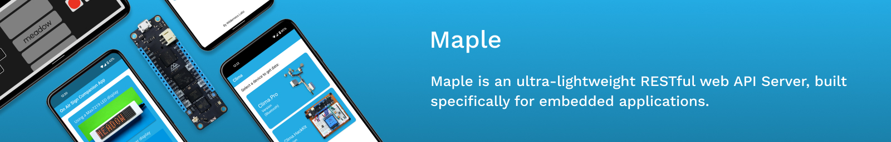
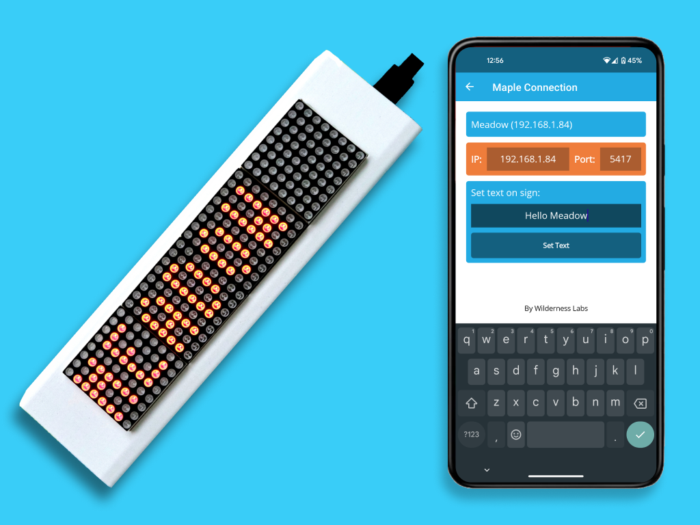
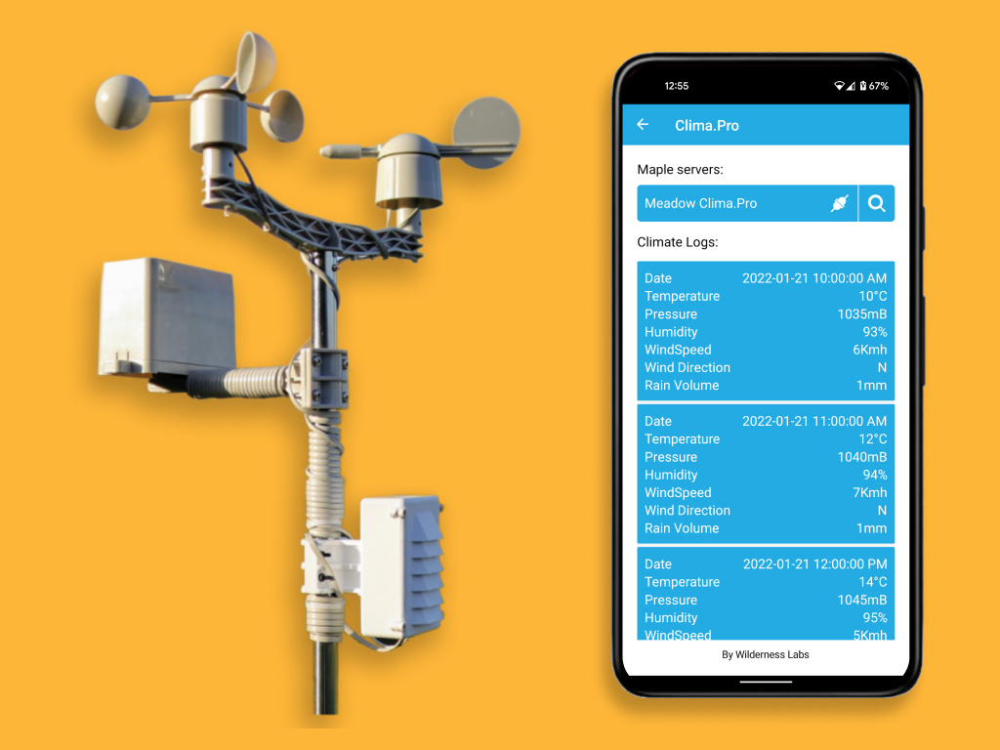

# Maple

Maple makes it easy to build connected devices with Meadow by exposing control via a Web API. Maple is an ultra-lightweight, JSON enabled, RESTful web server. It also has an advertise feature, meaning that you could discover Maple servers in your network by listening to UDP broadcast messages with its name and IP Address.

## Contents
* [Maple Server](#maple-server)
  * [Server Broadcasting](#server-broadcasting)
  * [Creating Web API Endpoints](#creating-web-api-endpoints)
  * [Attribute Routing](#attribute-routing)
  * [Handler Caching](#handler-caching)
  * [Returning an IActionResult](#returning-an-iactionresult)
* [Maple Client](#maple-client)
  * [Looking for Maple Servers](#looking-for-maple-servers)
  * [Sending HTTP Requests](#sending-hhtp-requests)
* [Project Samples](#project-samples)

## Maple Server

The Maple Web Server is primarily intended to provide RESTful endpoints from a device. It is modelled after ASP.NET Core and provides an easy to extend architecture with integrated JSON support via System.Text.Json.

### Server Broadcasting

Starting Maple on a Meadow board wont necesarily come with a display, so enabling Maple's discovery feature will broadcast the server's name along with its IP Address accross the network it joined to its easily discoverable by Maple Client's UDP listener built-in.

```csharp
mapleServer = new MapleServer(
    ipAddress: wifi.IpAddress, 
    port: 5417, 
    advertise: true); // <= Advertise Server over the network
mapleServer.Start();
```

### Creating Web API Endpoints

A web API consists of one or more request handler classes that derive from RequestHandlerBase:

```csharp
public class MyRequestHandler : RequestHandlerBase
```

### Attribute Routing

Maple determines API call routing based on Attribute routing of handler methods.

Routing is supported to either absolute or relative paths.

#### Absolute Routing

If your route begins with a forward slash (`/`) then it is considered an absolute route, and requests will be routed to the provided route regardless of the Handler class name.  

For example, the following will respond to `GET` requests to `http://[meadow.address]/hello`

```csharp
public class MyRequestHandler : RequestHandlerBase
{
    [HttpGet("/hello")]
    public OkObjectResult Hello()
    { ... }
}
```

#### Relative Routing

If your route *does not* begin with a forward slash (`/`) then it is considered a relative route, and requests will be routed to the provided route prefixed with an appreviated `RequestHandler` prefix.  The route prefix is determined by using the class name and trimming off any "Requesthandler" suffix.


For example, the following will respond to `GET` requests to `http://[meadow.address]/my/hello`

```csharp
public class MyRequestHandler : RequestHandlerBase
{
    [HttpGet("hello")]
    public OkObjectResult Hello()
    { ... }
}
```

But the following will respond to `GET` requests to `http://[meadow.address]/webapi/hello`

```csharp
public class WebAPI : RequestHandlerBase
{
    [HttpGet("hello")]
    public OkObjectResult Hello()
    { ... }
}
```

#### Route Parameters

> NOTE: Maple supports only a *single* parameter in a Route.

Maple supports providing a handler method parameter through the route path.  Parameters are delineated by curly braces, and the parameter name in the route must exactly match the parameter name in the handler method signature.

As an example, a `GET` to the path `http://[meadow.address]/orders/history/1234` would end up calling the following `GetOrderHistory` handler method with a parameter value of `1234`:

```csharp
public class OrdersRequestHandler : RequestHandlerBase
{
	[HttpGet("history/{orderID}")]
	public void GetOrderHistory(int orderID)
	{
	    Debug.WriteLine($"{paramName}");
	}
}
```

Supported parameter types are:

- Numerics (byte, short, int, long, float, double)
- bool
- string
- DateTime
- Guid

### Handler Caching

By default Maple will create a new instance of an API handler for every request received.  If you want your application to reuse the same handler instance, which provides faster handler execution and decreases GC allocation, simply override the `IsResuable` base property and return `true`.

```csharp
public override bool IsReusable => true;
```

### Returning an IActionResult

It is recommended that all Handler methods return an `IActionResult` implementation.  Extension methods are provided by Maple for common return objects including, but not limited to, `ActionResult`, `JsonResult`, `OkResult` and `NotFoundResult`.

For example, the following will automatically serialize and return a JSON string array with the proper `content-type` and return code.

```csharp
[HttpGet("/JsonSample")]
public IActionResult GetJsonList()
{
    var names = new List<string> {
        "George",
        "John",
        "Thomas",
        "Benjamin"
    };

    return new JsonResult(names);
}
```

## Maple Client

Maple Client is a convenience library intended to easily discover Maple servers over the network with their advertise feature turned on, and also send GET/POST request seamlessly to control a peripheral like a servo, or get data logs from environmental sensors.

Its dependency is .NET Standard 2.0, so it compatible with all sorts of .NET mobile and desktop apps built using Xamarin, WPF and even MAUI.

[image here]

### Looking for Maple Servers

When a Meadow application is running Maple with its [broadcasting feature](#server-broadcasting) turned on, we can use Maple Client to easily find it over the network. This snippet shows how you would discover Maple servers from a mobile/desktop:

```csharp
ObservableCollection<ServerModel> HostList = new ObservableCollection<ServerModel>();
.
.
MapleClient client = new MapleClient();
client.Servers.CollectionChanged += ServersCollectionChanged;
await client.StartScanningForAdvertisingServers();
.
.
void ServersCollectionChanged(object sender, NotifyCollectionChangedEventArgs e)
{
    switch (e.Action)
    {
        case NotifyCollectionChangedAction.Add:
            foreach (ServerModel server in e.NewItems)
            {
                HostList.Add(new ServerModel() { Name = $"{server.Name} ({server.IpAddress})", IpAddress = server.IpAddress });
            }
            break;
    }
}
```

You'll need a list of `ServerModel` that has both `Name` and `IPAddress` fields, and once a `MapleClient` object has been created, register the `ServerCollectionChanged` event handler that is triggered everytime a `Maple` server has been detected. Finally, call the `StartScanningForAdvertisingServers` async method to start listening for Maple servers broadcasting its information over UDP.

### Sending HTTP Requests

To send HTTP requests to Maple, you could do it with the standard HttpClient, and do regular GET/POST requests just like any other web API. Maple Client has simplified, encapsulated methods to send request to Maple servers. 

Sending a POST request, used to control peripherals on Meadow such as a servo, an LED, a relay, etc., will look something like this:

```csharp
bool response = await client.PostAsync(IpAddress, ServerPort, "rotateservo", "90");
```
In this snippet above, we're calling the endpoint `/RotateServo`, and a value of 90, which Meadow will interpret to make a servo rotate 90 degrees.

Sending a GET request, ideal to get information such as data logs from an environmental sensor, will look like this:

```csharp
var response = await client.GetAsync(IpAddress, ServerPort, "gettemperaturelogs");
```
This example will return a string that could be in plain text, `xml` or `json` format, and depending in the format its up to the developer to interpret the response. Maybe use `System.Text.Json` to deserialize a `json` response, for example.

## Project Samples

The following sample projects are using Maple to control a Meadow board using a MAUI application. 

<table>
    <tr>
        <td>
            <a href="https://www.hackster.io/wilderness-labs/remotely-control-an-rgb-led-with-meadow-and-xamarin-w-rest-153a28"></a><br/>
            Control a RGB LED with Meadow and MAUI using REST</br>
            <a href="https://www.hackster.io/wilderness-labs/remotely-control-an-rgb-led-with-meadow-and-xamarin-w-rest-153a28">Hackster</a> | <a href="Source/Hackster/Maple/MeadowMapleLed/">Source Code</a>
        </td>
        <td>
            <a href="https://www.hackster.io/wilderness-labs/remote-control-a-servo-with-meadow-and-xamarin-using-rest-063cb0"></a><br/>
            Control a Servo with Meadow and MAUI using REST</br>
            <a href="https://www.hackster.io/wilderness-labs/remote-control-a-servo-with-meadow-and-xamarin-using-rest-063cb0">Hackster</a> | <a href="Source/Hackster/Maple/MeadowMapleServo/">Source Code</a>
        </td>
        <td>
            <a href="https://www.hackster.io/wilderness-labs/get-temperature-logs-with-meadow-and-maui-using-rest-e529df"></a><br/>
            Get temperature logs with Meadow and MAUI using REST</br>
            <a href="https://www.hackster.io/wilderness-labs/get-temperature-logs-with-meadow-and-maui-using-rest-e529df">Hackster</a> | <a href="Source/Hackster/Maple/MeadowMapleTemperature/">Source Code</a>
        </td>
    </tr>
    <tr>
        <td>
            <a href="https://github.com/WildernessLabs/Meadow.ProjectLab.Samples/tree/main/Source/Connectivity"></a><br/>
            Control a Project Lab board over Wi-Fi with a MAUI app</br>
            <a href="https://github.com/WildernessLabs/Meadow.ProjectLab.Samples/tree/main/Source/Connectivity">Source Code</a>
        </td>
        <td>
            <a href="https://www.hackster.io/wilderness-labs/make-your-own-onair-sign-with-meadow-and-xamarin-ea0c9e"></a><br/>
            Make your own OnAir sign with Meadow and a MAUI using REST<br/>
            <a href="https://www.hackster.io/wilderness-labs/make-your-own-onair-sign-with-meadow-and-xamarin-ea0c9e">Hackster</a> | <a href="https://github.com/WildernessLabs/OnAir_Sign">Source Code</a>
        </td>
        <td>
            <a href="https://github.com/WildernessLabs/Meadow.ProjectLab.Samples/tree/main/Source/Connectivity"></a><br/>
            Control a Project Lab board over Wi-Fi with a MAUI app</br>
            <a href="https://github.com/WildernessLabs/Meadow.ProjectLab.Samples/tree/main/Source/Connectivity">Source Code</a>
        </td>
    </tr>
    <tr>
        <td>
            <p>&nbsp;&nbsp;&nbsp;&nbsp;&nbsp;&nbsp;&nbsp;&nbsp;&nbsp;&nbsp;&nbsp;&nbsp;&nbsp;&nbsp;&nbsp;&nbsp;&nbsp;&nbsp;&nbsp;&nbsp;&nbsp;&nbsp;&nbsp;&nbsp;&nbsp;&nbsp;&nbsp;&nbsp;&nbsp;&nbsp;&nbsp;&nbsp;</p>
        </td>
        <td>
            <p>&nbsp;&nbsp;&nbsp;&nbsp;&nbsp;&nbsp;&nbsp;&nbsp;&nbsp;&nbsp;&nbsp;&nbsp;&nbsp;&nbsp;&nbsp;&nbsp;&nbsp;&nbsp;&nbsp;&nbsp;&nbsp;&nbsp;&nbsp;&nbsp;&nbsp;&nbsp;&nbsp;&nbsp;&nbsp;&nbsp;&nbsp;&nbsp;</p>
        </td>
        <td>
            <p>&nbsp;&nbsp;&nbsp;&nbsp;&nbsp;&nbsp;&nbsp;&nbsp;&nbsp;&nbsp;&nbsp;&nbsp;&nbsp;&nbsp;&nbsp;&nbsp;&nbsp;&nbsp;&nbsp;&nbsp;&nbsp;&nbsp;&nbsp;&nbsp;&nbsp;&nbsp;&nbsp;&nbsp;&nbsp;&nbsp;&nbsp;&nbsp;</p>
        </td>
    </tr>
</table>